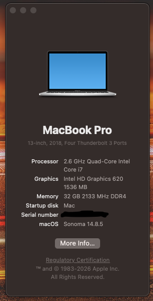

# OC EFI FOR MACOS SONOMA 14.8.5 ON HP ZBOOK 15 G3

This repository contains the necessary files and information to successfully boot macOS on this laptop. 

- Bootloader version: **OpenCore 1.0.0**
- SMBIOS: [MacBookPro15,2]
- Kexts version: All on latest version.
- macOS version: [Sonoma 14.8.5](https://www.apple.com/macos/sonoma)
- Remember to insert your own SMBIOS info to config file before booting to your USB

## Specs

| Component         | Brand                                     |
|-------------------|-------------------------------------------|
| **CPU**           |  Intel Core i7-6700HQ @ 2.8 GHz           |
| **iGPU**          |  Intel HD530 - SkyLake                    |
| **RAM**           |  40GB DDR4 Non-ECC                  |
| **Storage**       |  2x 256GB M.2 SSDs + 1x 1TB 2.5" SSD                   |
| **Audio**         |  Realtek ALC236 - layout-id 13            |
| **WiFi/BT Card**  |  Intel Wireless AC-8260                             |
| **Ethernet** | Intel I219LM Gigabit Ethernet                  |
| **OS**            |  macOS Sonoma 14.8.5                    |
| **BIOS**          |  N81           |

## Bios Settings

| Option                            | Setup                     |
|-----------------------------------|---------------------------|
| **Secure Boot**                   |  off                      |
| **Legacy Support**                |  off                      |
| **Fastboot**                      |  off                      |
| **Network (PXE) Boot**            |  off                      |
| **Wake On LAN**                   |  off                      |
| **LAN/WLAN Auto Switching**       |  off                      |
| **Graphic Mode**                  |  Auto (disable NVIDA Card)|
| **Video memory size**             |  64MB                     |
| **Fingerprint Device**            |  off                      |
| **Extended Idle Power States**    |  off                      |
| **Deep Sleep**                    |  on                       |
| **Wake On USB**                   |  off                      |
| **Others**                        |  default                  |

## What I have tested:

* GPU - Works perfectly fine, even used DaVinci Resolve.

* USB Ports - YAY!

* Ethernet - Amazing speeds.

* Wi-Fi - Its somewhat decent, range isn't really the best on macOS.

* Bluetooth - Amazing range, functions perfectly fine!

* HDMI - Even used it with my TV, as for my main setup, I use it with my monitor.

* Audio - Surprisingly worked on the first try.

* SD Card Reader - Transferred pictures from a camera!

* Smart Card Reader - I have no use-case for it but it works...!

## Not working (Didn't bother with fixing because I rarely use these features):

* Sleep & Hibernation - Causes kernel panic after 180s timeout.

* Brightness - When fixed, causes HDMI to stop functioning.

*  Thunderbolt Ports - Slipped out of my mind, might diagnose later, but its okay for now!

## Extra Info:

* I have tested macOS Sequoia - had decent performance but it was noticeably laggy in contrast to Sonoma. Audio functionality, Wi-Fi, and Bluetooth had all stopped working. Decided not to bother with it further and I stuck to Sonoma after that.

* My macOS is running on my 256GB NVMe SSD.

* Currently my daily driver, fell in love with macOS.

* I won't bother fixing the issues mentioned, but I most likely will experiment with the Thunderbolt ports.

## Need help??

* Feel free to request for help over my Instagram or Discord: retardedmonkeygaming

## References

* [Refer to Dortania's OC Install Guide.](https://dortania.github.io/OpenCore-Install-Guide/installer-guide/)
* [ProperTree](https://github.com/corpnewt/ProperTree)
* [GenSMBIOS](https://github.com/corpnewt/GenSMBIOS)
